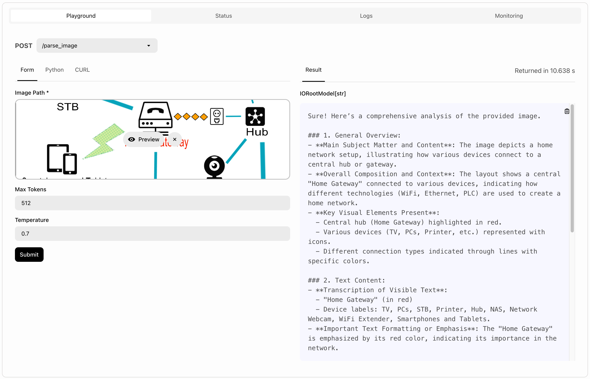

# VLM Parsing Example Bento

This is a BentoML service that demonstrates how to parse image using multi-modal LLM and extract useful information from them.

_The work is based on @PsiACE's [blog post](https://psiace.me/posts/a-dead-simple-way-to-vlm-parsing/)._

## Start the development server

This project is managed by [PDM](https://pdm-project.org), install it first.

Install dependencies:

```bash
pdm install
```

Create `.env` file with credentials:

```bash
cp .env.example .env
# Complete the OPENAI_API_KEY in the .env file
```

Start the development server:

```bash
pdm dev
```

## Deploy to BentoCloud

1. Go to [BentoCloud](https://cloud.bentoml.com) and get an account.
2. Click "Secret" in the sidebar and create an "OpenAI" secret with your API key.
3. Deploy the service to BentoCloud:

   ```bash
   pdm deploy --secret <your-secret-name>
   ```




## License

This work is released under [Unlicense](LICENSE). You can use it for any purpose without any restriction.

